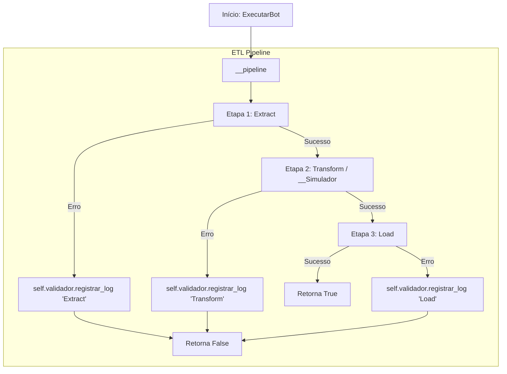
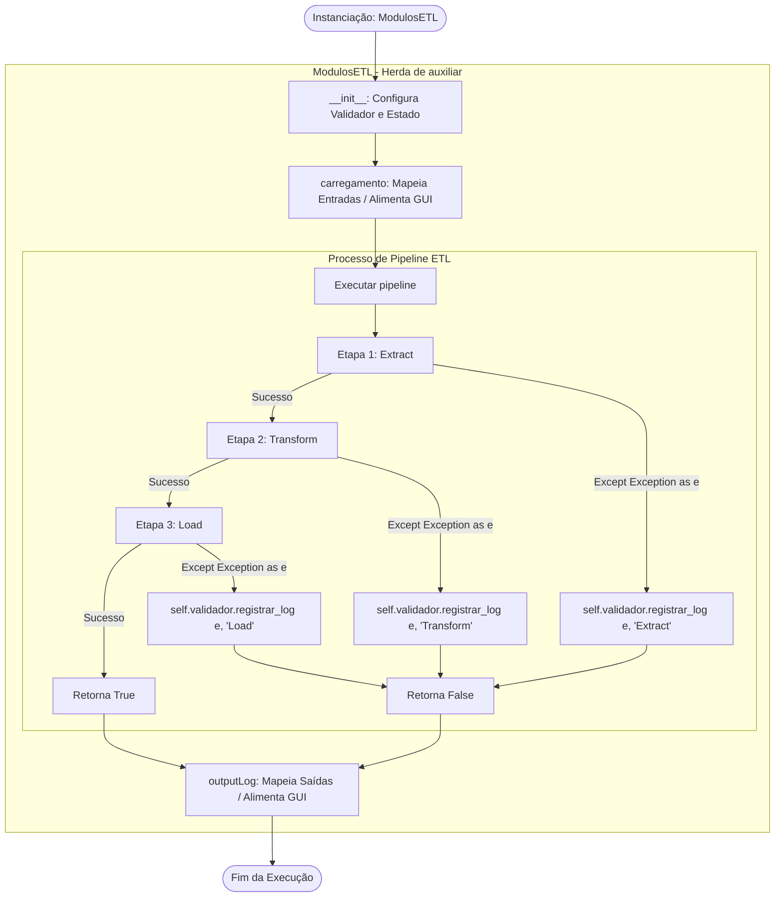

<h1 align="center">GERENCIAMENTO DE AUTOMAÇÃO 🦥</h1>

<table align="center">
<tr>
<!-- Lado Esquerdo: Frase, Links e Badges -->
<td align="center" valign="middle">

    <h3>"Deixe o robô trabalhar enquanto você toma um café."</h3>
    <h2>
        <a href="https://www.linkedin.com/in/wesley-henrique22" target="_blank" rel="noopener noreferrer">LinkedIn</a> |
        <a href="https://github.com/wesley-henrique1" target="_blank" rel="noopener noreferrer">GitHub</a> | 
        <a href="https://www.bing.com/search?q=aqui%20estou%20devendo%20link&qs=n&form=QBRE&sp=-1&ghc=1&lq=0&pq=aqui%20estou%20devendo%20link&sc=12-23&sk=&cvid=989C403393164B4298A65FE780076F4B" target="_blank" rel="noopener noreferrer">Instagram</a>
    </h2>
    <p align="center">
        
        
        
        
    </p>
</td>

<!-- Lado Direito: Imagem Principal -->
<td align="center" valign="middle" width="300">
    
</td>
</tr>
</table>

---
# 🎯 Objetivo do Projeto

Centralizar e gerenciar a execução de automações e pipelines de dados em um painel único. A plataforma elimina a execução manual de scripts `.py` no terminal/IDE, organizando as operações através de uma interface gráfica amigável categorizada em:

---
---
<br><br>

# 🏗️ Arquitetura de Módulos (scripty.py)
A estrutura do projeto adota o princípio de responsabilidade única, onde cada módulo é estritamente isolado para tratar um domínio específico da aplicação:
> **Módulo GUI (Interface Gráfica):**

- **Responsabilidade:** Renderização visual e integração com o usuário.

- **Detalhamento:** Focado exclusivamente no desenho dos elementos da interface (janelas, botões, formulários, áreas de log) e na intermediação dos comandos do usuário com os módulos subjacentes (Bots e ETL).
---
> **Módulo Bots (RPA):**
- **Responsabilidade:** Automação de tarefas operacionais e navegação em interface gráfica.

- **Detalhamento:** Executa rotinas sequenciais e repetitivas simulando interações humanas (cliques, digitação e atalhos via PyAutoGUI), preenchimento automatizado de formulários e navegação em sistemas que não possuem API nativa.

---
> **Módulo Pipelines de Dados (ETL):**
- **Responsabilidade:** Extração, transformação e carga de dados.

- **Detalhamento:** Concentra a lógica de negócios de dados (ETL). Realiza a leitura de fontes brutas, higienização, cruzamento de tabelas (data wrangling), validação de regras de negócio e geração de relatórios ou arquivos de saída prontos para uso.

---

## 🏗️ Arquitetura dos Módulos GUI (Interface Gráfica do Usuário).
>### 💻 Código-Fonte
``` python
import tkinter as tk

class auxiliar:
    "Separar as ação da interface da construção dos componentes"
    pass

class GUI_autobot:
    def __init__(self):
        root = tk.Tk()

        """ Atributos """

        self.Componentes(root)
        self.Clicaveis(root)
        self.Localizar()
        root.mainloop()
        pass

    def Componentes(self, Tela):
        pass
    def Clicaveis(self, Tela):
        pass
    def Localizar(self):
        pass
```
> 1.  `auxiliar` (Classe Auxiliar) <br>
**Responsabilidade:** Agrupa as funções utilitárias e manipuladores de eventos (event handlers) acionados pelos botões, promovendo o desacoplamento entre a regra de negócio/ações executadas e a renderização visual.

> 2. `GUI_autobot` (Classe Principal de Pipeline) <br>
 **Responsabilidade:** Responsável pela montagem da estrutura visual da aplicação, inicialização dos componentes de tela e coordenação do fluxo de automação, conectando as entradas do usuário ao pipeline de execução.
 
---
>### 📋 Resumo dos Métodos
| Método | Finalidade | Responsabilidade |
| :--- | :--- | :--- |
| `__init__()` | Ciclo de Vida | Inicializa a janela principal (tk.Tk), define o estado inicial dos atributos e orquestra a construção e exibição da interface até a execução do loop principal (mainloop()).|
| `Componentes(Tela)` | Construção | Instancia e configura os componentes visuais (widgets) estáticos e dinâmicos, como rótulos, campos de texto, barras de progresso e a área de logs. |
| `Clicaveis(Tela)` | Vinculação | Centraliza a instanciação e a vinculação de ações (callbacks) de todos os elementos clicáveis e interativos da interface (botões, atalhos, toggles, etc.). |
| `Localizar()` | Diagramação | Gerencia o posicionamento, alinhamento, espaçamento e o comportamento de redimensionamento dos elementos visuais na janela (utilizando os gerenciadores grid, pack ou place) |
---

## 🏗️ Arquitetura dos Módulos Bots (RPA):
>### 💻 Código-Fonte
```python
import pandas as pd
class auxiliar:
    pass

class ProcessarProduto:
    def __init__(self):
        pass

    def __Simulador(self, df: pd.DataFrame):
        pass

    def __pipeline(self, listaPath: list[str], listaSave: list[str]):
        try:
            pass
        except Exception as e:
            self.validador.registrar_log(e, "Extract")
            return False
        try:
            pass
        except Exception as e:
            self.validador.registrar_log(e, "Transform")
            return False
        try:
            return True
        except Exception as e:
            self.validador.registrar_log(e, "Load")
            return False

    def ExecutarBot(self, listaPath: list[str], listaSave: list[str]):
        pass
```

---
> 1.  auxiliar (Classe Auxiliar) <br>
**Responsabilidade:** Agrupar funções utilitárias e ajudantes (*helpers*) secundárias que suportam as regras de negócio ou transformações genéricas de dados.

> 2. `ProcessarProduto` (Classe Principal de Pipeline) <br>
**Responsabilidade:** Orquestrar o ciclo de vida completo do processamento de dados de produtos, incluindo a simulação, etapas de ETL e controle do fluxo do bot.

---
>### 📋 Resumo dos Métodos
| Método | Visibilidade | Responsabilidade |
| :--- | :--- | :--- |
| `__init__()` | Público | Inicializa os atributos da classe, como instâncias do validador/logger e configurações do ambiente. |
| `__Simulador(df)` | Privado | Executa a operação do bot, simulação de teclas|
| `__pipeline(listaPath, listaSave)` | Privado | Executa as fases operacionais do ETL (Extract, Transform, Load) com captura individual de exceções por etapa. |
| `ExecutarBot(listaPath, listaSave)` | Público | centralizar e organizar toda a execução do modulo|

---
>### 🔄 Fluxo de Execução (Diagrama ETL)

---

## 🏗️ Arquitetura dos Módulos Pipelines:
>### 💻 Código-Fonte
```python
class auxiliar:
    pass

class ModulosETL(auxiliar):
    def __init__(self):
        pass
    def pipeline(self):
        try:
            pass
        except Exception as e:
            self.validador.registrar_log(e, "Extract")
            return False
        try:
            pass
        except Exception as e:
            self.validador.registrar_log(e, "Transform")
            return False
        try:
            return True
        except Exception as e:
            self.validador.registrar_log(e, "Load")
            return False

    def carregamento(self, validar: list[str]):
        pass
    def outputLog(self, validar: list[str]):
        pass
```
> 1.  `auxiliar` (Classe Auxiliar) <br>
**Responsabilidade:** Concentra funções secundárias e operacionais (como validações, formatação de tipos, sanitização de strings e tratamento de exceções) que dão suporte à execução das regras de negócio do módulo de ETL, evitando duplicação de código.

> 2. `ModulosETL` (Classe Principal de Pipeline) <br>
 **Responsabilidade:** Responsável por localizar, ler e mapear as bases de dados de origem, executar a sequência de transformações necessárias e salvar/entregar os dados processados na camada de saída ou no destino final do pipeline.

---
>### 📋 Resumo dos Métodos
| Método | Visibilidade | Responsabilidade |
| :--- | :--- | :--- |
| `__init__()` | Público | Inicializa os atributos da classe, como instâncias do validador/logger e configurações do ambiente. |
| `pipeline()` | Público | Executa as fases operacionais do ETL (Extract, Transform, Load) com captura individual de exceções por etapa. |
| `carregamento(self, validar: list[str])` | Público | Mapeia e valida os arquivos e bases de entrada do pipeline, consolidando os metadados em um dicionário para alimentação da interface (GUI).|
| `outputLog(self, validar: list[str])` | Público |  Mapeia e valida os relatórios e artefatos de saída gerados no processamento, montando a estrutura de dicionário enviada à GUI para exibição de logs/resultados|


---
>### 🔄 Fluxo de Execução (Diagrama ETL)

---